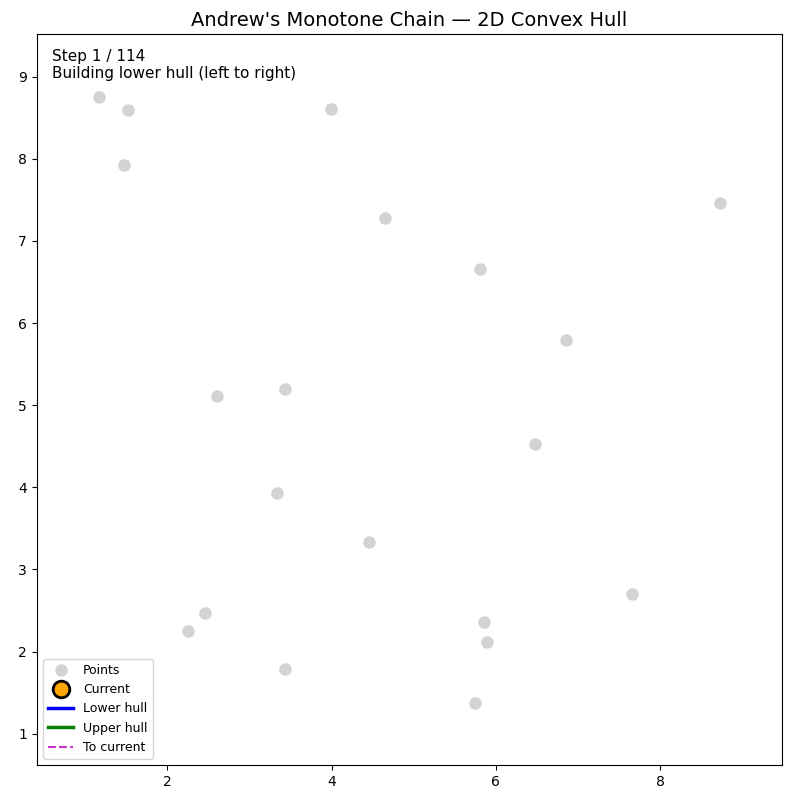

# 第5章 Andrew's Monotone Chain

Andrew's Monotone Chain（アンドリューの単調チェーン）は、Graham Scan と同様に $O(n \log n)$ で凸包を求めつつ、**atan2 を使わずに座標比較だけでソート**するアルゴリズムです。1979年に A.M. Andrew によって発表されました。実装が簡潔で数値的に安定しており、競技プログラミングや実務でもよく使われます。

---

## 5.1 Graham Scan の改良としての位置づけ

Graham Scan では、基準点から見た**極角**でソートするために `atan2` を使います。しかし atan2 には次の問題があります。

- **浮動小数点の誤差**：ほぼ同一直線上の点で角度が微妙にずれ、ソート順が不安定になる
- **計算コスト**：三角関数の計算は比較的重い
- **境界での扱い**：基準点と同一方向の点で角度が不定になりやすい

Andrew's Monotone Chain は、**x 座標（同点なら y 座標）** による単純な辞書順ソートのみを使います。三角関数を一切使わないため、数値的に安定し、実装も短くて済みます。Graham Scan と同じ「スタックで凸包を構築する」考え方に、ソート方法の改良を加えたバージョンとみなせます。

---

## 5.2 上下凸包に分けるアイデア

Andrew's Monotone Chain の核心は、凸包を**下側**と**上側**の2本の単調な鎖（チェーン）に分けて構築することです。

### 単調鎖（Monotone Chain）とは

点列を **x 座標の増加順**（同点なら y 座標の増加順）に並べます。この順序では、左端から右端へ向かう「下側の凸包」と、右端から左端へ戻る「上側の凸包」が、それぞれ x について単調に進む鎖として表現できます。

```
       上側凸包
      •-------•
     /         \
    •           •
     \         /
      •-------•
       下側凸包

  左端 ←――――――――――→ 右端
       x 増加方向
```

### 構築の流れ

1. **ソート**：点を (x, y) の辞書順でソートする。
2. **下側凸包**：ソート順（左→右）に点を見ていき、Graham Scan と同様に「右折したら pop」するスタックで下側の鎖を構築する。
3. **上側凸包**：ソート順を逆に（右→左）して、同様にスタックで上側の鎖を構築する。
4. **結合**：下側凸包と上側凸包を繋ぎ、左右の端点の重複を除いて凸包全体を得る。

上下に分けることで、極角を使わずに「左から右」と「右から左」の2方向の走査だけで凸包が求まります。

以下のアニメーションは、Andrew's Monotone Chain の動作を可視化したものです（`Chapter05/animation.py` で生成）。



---

## 5.3 座標比較のみでソート（atan2 不要）

ソートは次の比較で行います。

```python
# (x, y) の辞書順
points.sort(key=lambda p: (p.x, p.y))
```

**C++ の例：**

```cpp
sort(points.begin(), points.end(), [](const Point2D& a, const Point2D& b) {
    if (a.x != b.x) return a.x < b.x;
    return a.y < b.y;
});
```

これだけで、左端（x 最小）から右端（x 最大）に向かう順序が決まります。atan2 や距離計算は不要です。

### なぜこれで十分か

凸包の下側鎖は、左端の点から右端の点へ、x が単調に増加しながら進みます。上側鎖はその逆に、右端から左端へ x が単調に減少しながら進みます。辞書順ソートにより、下側鎖の構築には左→右の順、上側鎖の構築には右→左の順（つまりソート済み列の逆順）で点を処理すれば十分です。

---

## 5.4 実装の簡潔さと数値安定性

### 完全実装

```python
from typing import List

class Point2D:
    def __init__(self, x: float, y: float):
        self.x, self.y = x, y

def cross(o, a, b) -> float:
    return (a.x - o.x) * (b.y - o.y) - (a.y - o.y) * (b.x - o.x)

def andrew_monotone_chain(points: List[Point2D]) -> List[Point2D]:
    n = len(points)
    if n < 3:
        return list(points)

    # (x, y) の辞書順でソート
    points = sorted(points, key=lambda p: (p.x, p.y))

    def build_hull(hull_points):
        """下側または上側の凸包を構築。点列は hull_points の順に処理される。"""
        hull = []
        for p in hull_points:
            while len(hull) >= 2 and cross(hull[-2], hull[-1], p) <= 0:
                hull.pop()
            hull.append(p)
        return hull

    # 下側凸包（左→右）
    lower = build_hull(points)
    # 上側凸包（右→左）
    upper = build_hull(reversed(points))

    # 下端の右端と上端の左端の重複を除いて結合
    return lower[:-1] + upper[:-1]
```

### 数値安定性

- **三角関数を使わない**：atan2 による角度誤差がなくなる。
- **比較は外積のみ**：外積も浮動小数点演算だが、角度そのものを計算するより誤差が広がりにくい。
- **eps の扱い**：必要に応じて `cross(...) <= 0` を `cross(...) < -EPS` に変えるなど、第2章の方針に従って調整できる。

---

## 5.5 Graham Scan との比較

| 項目 | Graham Scan | Andrew's Monotone Chain |
|------|-------------|-------------------------|
| **ソート基準** | 極角（atan2） | x, y の辞書順 |
| **計算量** | $O(n \log n)$ | $O(n \log n)$ |
| **数値安定性** | atan2 の誤差に注意 | 比較的安定 |
| **実装の長さ** | 基準点の選び方、同角時の距離比較が必要 | 短く書ける |
| **凸包の構築** | 1本の鎖をスタックで構築 | 下側・上側の2本を別々に構築して結合 |
| **出力の順序** | 基準点から反時計回り | 左端から反時計回り（下側→上側） |

### 使い分けの目安

- **Andrew's Monotone Chain を優先してよい場面**：一般的な凸包問題。実装が簡単で安定しているため、特に理由がなければこちらを使うのがおすすめです。
- **Graham Scan が向く場面**：極角に基づく処理を後で行う、既存コードが Graham Scan ベースである、などの場合。

---

## 本章のまとめ

- **Andrew's Monotone Chain** は、Graham Scan と同様 $O(n \log n)$ で凸包を求めるが、atan2 を使わない。
- **上下凸包に分ける**：x 座標の辞書順ソートの後、左→右で下側、右→左で上側の鎖をスタックで構築する。
- **座標比較だけでソート**できるため、実装が簡潔で数値的に安定している。
- 多くの実用場面では、Graham Scan より Andrew's Monotone Chain の採用を推奨できる。

次章では、点の**追加・削除**に対応する**動的凸包**を扱います。
