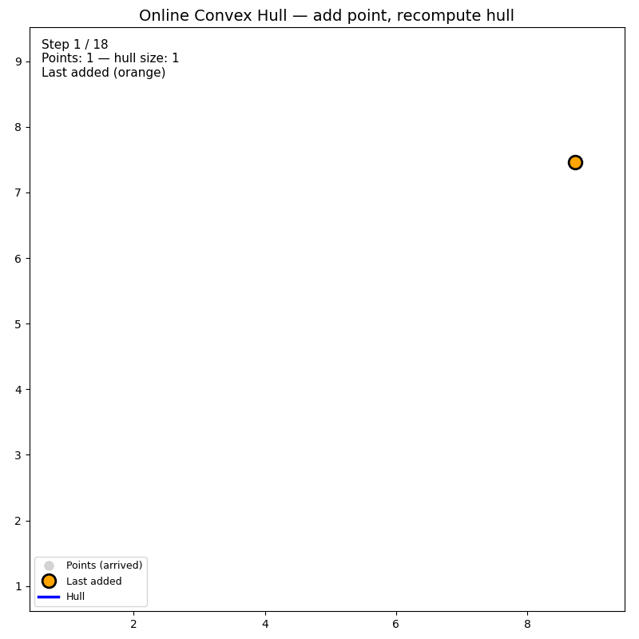

# 第6章 動的凸包

これまでのアルゴリズム（Graham Scan、Andrew's Monotone Chain など）は、点集合が**あらかじめ与えられた状態**で凸包を計算します。一方、**動的凸包**（Dynamic Convex Hull）は、点の**追加**や**削除**が発生する状況で、凸包を逐次更新する問題です。ストリーミングデータやリアルタイム処理では、この動的な更新が必須になります。

---

## 6.1 点の追加・削除に対応する凸包の更新

### 問題の定式化

- **初期状態**：空の点集合、またはいくつかの点とその凸包
- **操作**：
  - **add(p)**：点 $p$ を追加し、凸包を更新する
  - **remove(p)**：点 $p$ を削除し、凸包を更新する
- **クエリ**：現時点の凸包の頂点列や面積などを返す

### 素朴な方法：毎回再計算

もっとも単純な方法は、追加・削除のたびに凸包を**最初から再計算**することです。

- **add(p)**：点を追加して、Andrew's Monotone Chain などを実行 → $O(n \log n)$
- **remove(p)**：点を削除して、同様に再計算 → $O(n \log n)$

実装は簡単で、点の数が少ない（数千程度まで）場合は十分実用的です。削除が頻繁でない場合も、この方法で済ませることがあります。

### 効率的な方法：増分更新

点の**追加のみ**を考えた場合、適切なデータ構造を使うと 1 回の追加を $O(\log n)$ で行えます。

**追加時の処理の流れ：**

1. **凸包の内外判定**：新しい点 $p$ が現在の凸包の内部にあるか判定する。
2. **内部のとき**：凸包は変化しない。何もしない。
3. **外部のとき**：$p$ から凸包への**接線**（tangent）を引き、接線が触れる2頂点を求める。その2頂点の間の弧を、$p$ と結ぶ2本の辺に置き換える。

```
    新しい点 p が凸包の外
         •
        p
       / \
      /   \   接線が触れる2頂点の間の弧を
     /     \   p への2辺に置き換える
    •-------•
```

**接線の求め方**

凸包を**上側**と**下側**の2本の鎖で管理している場合、$p$ から見て「最も左」「最も右」にある頂点を探すと、それが接点になります。平衡二分探索木（例：C++ の `std::set`）で凸包の頂点を x 座標順に保持しておくと、二分探索で接点を $O(\log n)$ で見つけられます。

**削除**

点の削除は追加よりも難しく、一般には次のような方針になります。

- **削除も $O(\log n)$**：Overmars–van Leeuwen のデータ構造など、専用の構造を使う（実装は複雑）
- **削除時は再計算**：削除のたびに凸包を $O(n \log n)$ で再計算する
- **論理削除**：削除フラグを立て、定期的に凸包を再構築する

---

## 6.2 オンラインアルゴリズムの基礎

### オンライン vs オフライン

| 種類 | 説明 | 凸包での例 |
|------|------|------------|
| **オフライン** | 全データを事前に受け取り、一括処理 | 点集合がまとめて与えられ、凸包を一度計算 |
| **オンライン** | データが1つずつ到着し、到着するたびに処理 | 点が1つずつ追加され、毎回凸包を更新 |

動的凸包の**追加のみ**のケースは、オンラインアルゴリズムの典型例です。未来の点は未知で、これまでに受け取った点だけを使って凸包を維持します。

### オンライン凸包のアルゴリズム

**増分構築（Incremental Construction）**

点を1つずつ追加していき、毎回凸包を更新します。

- **素朴**：毎回 Graham Scan や Andrew's Monotone Chain を実行 → 1点あたり $O(n \log n)$
- **効率的**：平衡二分探索木で凸包を管理 → 1点あたり $O(\log n)$（追加点が凸包の外にある場合）

**逐次追加の疑似コード（素朴版）**

```
OnlineConvexHull():
    hull = []   // 凸包の頂点列

    for each new point p:
        points.append(p)
        hull = andrew_monotone_chain(points)  // 再計算
        // または、hull が空 or 2点以下の場合は特別処理
```

**逐次追加の疑似コード（効率化の考え方）**

```
// 上側・下側の凸包を平衡二分探索木で管理
upper, lower = empty balanced trees

add(p):
    if |points| < 3:
        points.add(p)
        rebuild_hull()
        return
    if p が現在の凸包の内部:
        return
    (left_tangent, right_tangent) = find_tangents(p)
    upper と lower から、接点間の頂点を削除
    upper と lower に p を接点と繋ぐ形で挿入
```

以下のアニメーションは、オンライン凸包（点を1つずつ追加し、毎回凸包を再計算する素朴版）の動作を可視化したものです（`Chapter06/animation.py` で生成）。



---

## 6.3 応用：リアルタイム処理

動的凸包は、点がリアルタイムで増えていく場面でよく使われます。

### ストリーミングデータ

センサーやログから点が次々と届く場合、毎回全点から凸包を計算するのはコストが高いです。1点あたり $O(\log n)$ で更新できる動的凸包を使えば、大量のストリームでもリアルタイム性を保ちやすくなります。

### 追跡・検出

- **物体追跡**：画像上で検出した点群の凸包を、フレームごとに更新する。新たに検出された点を追加、見えなくなった点を削除（または一定時間で削除）。
- **クラスタの外形**：クラスタに属する点が増減するとき、クラスタの凸包を逐次更新する。

### インタラクティブな可視化

ユーザーがマウスで点を追加・削除できるアプリケーションでは、操作のたびに凸包を更新する必要があります。点の数が数百〜数千程度であれば、毎回 Andrew's Monotone Chain で再計算するだけでも十分な場合が多く、実装が簡単です。

### 実装例（素朴版：再計算による動的凸包）

```python
from typing import List

class DynamicConvexHull:
    """点の追加に対応する凸包（追加ごとに再計算する版）"""

    def __init__(self):
        self.points: List[Point2D] = []

    def add(self, p: Point2D) -> None:
        self.points.append(p)

    def remove(self, p: Point2D) -> None:
        self.points = [q for q in self.points if (q.x, q.y) != (p.x, p.y)]

    def get_hull(self) -> List[Point2D]:
        return andrew_monotone_chain(self.points)

    def contains(self, p: Point2D) -> bool:
        """点 p が凸包の内部または境界上にあるか"""
        hull = self.get_hull()
        if len(hull) < 3:
            return p in hull
        for i in range(len(hull)):
            a, b = hull[i], hull[(i + 1) % len(hull)]
            if cross(a, b, p) < 0:  # 外側にあれば False
                return False
        return True
```

### 計算量のトレードオフ

| 方式 | add の計算量 | remove の計算量 | 実装 |
|------|--------------|-----------------|------|
| 毎回再計算 | $O(n \log n)$ | $O(n \log n)$ | 簡単 |
| 増分更新（追加のみ） | $O(\log n)$ | — | やや複雑 |
| 完全動的（Overmars 等） | $O(\log n)$ | $O(\log n)$ | 複雑 |

用途に応じて、実装の手軽さと計算量のバランスを選びます。

---

## 本章のまとめ

- **動的凸包**は、点の追加・削除に対応して凸包を逐次更新する問題である。
- **素朴な方法**は、操作のたびに凸包を再計算する（1回 $O(n \log n)$）。実装が簡単で、点が少ないときは実用的。
- **効率化**：追加のみなら平衡二分探索木を用いて 1 回 $O(\log n)$ にできる。削除は一般的に難しい。
- **オンラインアルゴリズム**として、点が1つずつ到着する状況で凸包を維持できる。
- **応用**：ストリーミング、物体追跡、インタラクティブな可視化など、リアルタイム処理で活用される。

次章では、**QuickHull**（分割統治法）を学びます。点集合を再帰的に分割し、凸包を構築するアルゴリズムです。
