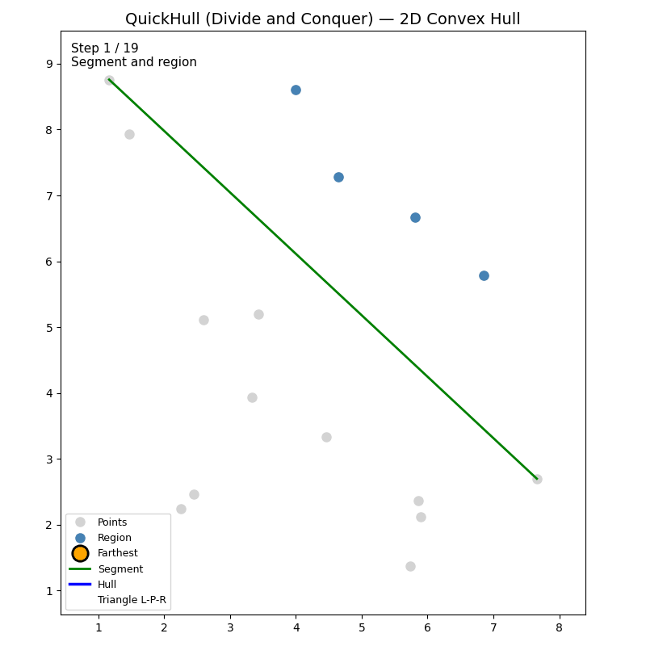

# 第7章 QuickHull（分割統治法）

QuickHull（クイックハル）は、**分割統治法**（Divide and Conquer）に基づく凸包アルゴリズムです。名前の由来は QuickSort と同様で、点集合を分割しながら再帰的に凸包を構築します。Qhull をはじめとする多くの実装の基盤となっており、3次元や高次元への拡張も自然に行えます。

---

## 7.1 分割統治のアイデア

### 最遠点で分割し、再帰的に凸包を構築

QuickHull の流れは次のとおりです。

1. **両端を決める**：x 座標が最小の点 $L$ と最大の点 $R$ を選ぶ。これらは凸包の頂点である。
2. **点を2つのグループに分ける**：直線 $\overline{LR}$ を基準に、その**上側**にある点の集合 $S_{\text{upper}}$ と**下側**にある点の集合 $S_{\text{lower}}$ に分ける。直線上にある点はどちらにも含めない（凸包の辺上となる）。
3. **最遠点を求める**：各グループについて、直線 $\overline{LR}$ から**最も遠い**点 $P$ を求める。$P$ は凸包の頂点である。
4. **三角形で排除**：三角形 $\triangle LPR$ の内部にある点は凸包に含まれないので、それらを除外する。
5. **再帰**：直線 $\overline{LP}$ の上側の点と、直線 $\overline{PR}$ の上側の点に対して、同様の処理を再帰的に行う。
6. **下側も同様**：$S_{\text{lower}}$ に対しても 3〜5 を実行する。

```
      P (最遠点)
     / \
    /   \    三角形 L-P-R の外側の点だけを
   / ・  \    再帰的に処理
  /  ・   \
 L -------- R
  \  ・   /
   \ ・  /
    \   /
     \ /
```

各再帰で「凸包上にある点」を1つ見つけ、その点で領域を分割して不要な点を捨てていくのがポイントです。

以下のアニメーションは、QuickHull の動作を可視化したものです（`Chapter07/animation.py` で生成）。



---

## 7.2 点と直線の距離・符号付き距離

### 符号付き距離と外積

直線 $\overline{AB}$ と点 $P$ について、**外積** $\text{cross}(A, B, P)$ は次の意味を持ちます。

- **絶対値**：$A$, $B$, $P$ が作る三角形の面積の2倍。直線 $\overline{AB}$ から点 $P$ への距離に比例する。
- **符号**：$P$ が直線 $\overline{AB}$ のどちら側にあるかを表す。
  - $\text{cross}(A, B, P) > 0$：$P$ は直線の**左側**（$A \to B$ の向きで進んだときの左）
  - $\text{cross}(A, B, P) < 0$：$P$ は直線の**右側**
  - $\text{cross}(A, B, P) = 0$：$P$ は直線上

したがって、外積を「符号付き距離」として使えます。距離の比較には絶対値を使い、点の属する側の判定には符号を使います。

### 最遠点の求め方

直線 $\overline{LR}$ から最も遠い点は、$\lvert \text{cross}(L, R, P) \rvert$ が最大となる点 $P$ です。同一側の点だけで比較するなら、$\text{cross}(L, R, P)$ の絶対値が最大の点を選べば十分です。

```python
def signed_dist(a, b, p) -> float:
    """直線 AB から点 P への符号付き距離（外積）"""
    return cross(a, b, p)

def farthest_point(a, b, points: List[Point2D]) -> Optional[Point2D]:
    """直線 AB の左側にある点のうち、直線から最も遠い点を返す"""
    best = None
    best_dist = 0
    for p in points:
        d = signed_dist(a, b, p)
        if d > best_dist:  # 左側のみ（d > 0）、かつ最遠
            best_dist = d
            best = p
    return best
```

---

## 7.3 疑似コードと再帰構造

### 疑似コード

```
QuickHull(P):
    if |P| < 3:
        return P

    L = x 座標が最小の点
    R = x 座標が最大の点

    S_upper = {p in P : cross(L, R, p) > 0}
    S_lower = {p in P : cross(L, R, p) < 0}

    hull_upper = FindHull(S_upper, L, R)
    hull_lower = FindHull(S_lower, R, L)   // R→L の向きで下側

    return [L] + hull_upper + [R] + hull_lower

FindHull(S, A, B):
    // 直線 AB の左側にある点の集合 S から、A-B を結ぶ凸包の弧を求める
    if S が空:
        return []

    P = S のうち直線 AB から最も遠い点
    S1 = {p in S : cross(A, P, p) > 0}   // 直線 AP の左側
    S2 = {p in S : cross(P, B, p) > 0}   // 直線 PB の左側

    hull1 = FindHull(S1, A, P)
    hull2 = FindHull(S2, P, B)

    return hull1 + [P] + hull2
```

### 再帰のイメージ

```
FindHull(S, L, R):
  P = 最遠点
  [L] -- FindHull(S1, L, P) -- [P] -- FindHull(S2, P, R) -- [R]
```

$L \to P \to R$ は凸包の弧をなし、三角形 $\triangle LPR$ の外側の点だけが再帰で扱われます。

---

## 7.4 平均計算量と最悪計算量

### 平均計算量

点が一様に分布している場合、各再帰で多くの点が三角形の内側で捨てられるため、再帰の深さは浅くなりがちです。このとき、平均的には $O(n \log n)$ 程度になることが知られています。

### 最悪計算量

最悪ケースでは、毎回「最遠点」が端に寄り、ほとんど点が捨てられないような配置になります。その場合、再帰の深さが $O(n)$ になり、全体で $O(n^2)$ となります。

例：点が凸多角形の周上に並んでおり、毎回の最遠点が隣の頂点になるような配置。

| 状況 | 計算量 |
|------|--------|
| 平均（一様分布） | $O(n \log n)$ |
| 最悪 | $O(n^2)$ |
| 最良（点が少ない or 多くが捨てられる） | $O(n)$ に近い |

Graham Scan や Andrew's Monotone Chain の $O(n \log n)$ は最悪でも保証されますが、QuickHull は入力によっては遅くなる可能性があります。一方、3次元以上への拡張や、実装の単純さの面で QuickHull が選ばれることがあります。

---

## 7.5 実装演習

### Python 実装

```python
from typing import List, Optional

class Point2D:
    def __init__(self, x: float, y: float):
        self.x, self.y = x, y

def cross(o, a, b) -> float:
    return (a.x - o.x) * (b.y - o.y) - (a.y - o.y) * (b.x - o.x)

def quick_hull(points: List[Point2D]) -> List[Point2D]:
    n = len(points)
    if n < 3:
        return list(points)

    points = sorted(points, key=lambda p: (p.x, p.y))
    left = points[0]
    right = points[-1]

    upper = [p for p in points if cross(left, right, p) > 0]
    lower = [p for p in points if cross(left, right, p) < 0]

    hull_upper = _find_hull(upper, left, right)
    hull_lower = _find_hull(lower, right, left)

    return [left] + hull_upper + [right] + hull_lower

def _find_hull(points: List[Point2D], a: Point2D, b: Point2D) -> List[Point2D]:
    if not points:
        return []

    # 直線 AB から最も遠い点（呼び出し元で左側の点のみ渡される）
    farthest = max(points, key=lambda p: cross(a, b, p))

    s1 = [p for p in points if p != farthest and cross(a, farthest, p) > 0]
    s2 = [p for p in points if p != farthest and cross(farthest, b, p) > 0]

    hull1 = _find_hull(s1, a, farthest)
    hull2 = _find_hull(s2, farthest, b)

    return hull1 + [farthest] + hull2
```

上の実装では、`upper` と `lower` の分割後に、`_find_hull` 内で再度「左側の点」を確認しています。最初の分割で `cross(left, right, p) > 0` の点だけを `upper` に入れているので、`_find_hull(upper, left, right)` に渡される点はすべて直線の左側です。同様に、`lower` は直線の右側なので、`_find_hull(lower, right, left)` では $R \to L$ の向きで「左側」= 元の直線の下側の点を扱います。

### 演習

1. ランダムな点集合で凸包が正しく求まるか確認する。
2. 全点が凸多角形の周上にあるケースで、計算時間の変化を観察する。
3. 再帰の各ステップで、三角形 $\triangle LPR$ によって除外される点を可視化する。

---

## 7.6 正しさの証明（QuickHull の分割統治が全点を網羅する理由）

### なぜ正しい凸包が求まるか

**（1）$L$ と $R$ は凸包の頂点である**

x 座標が最小・最大の点は、凸包の左端・右端にあり、必ず凸包の頂点です。

**（2）最遠点 $P$ は凸包の頂点である**

直線 $\overline{LR}$ の上側（または下側）にある点のうち、直線から最も遠い点は、その領域で「最も外にはみ出した」点です。凸包の定義から、そのような点は凸包の頂点になります。

**（3）三角形 $\triangle LPR$ の内部の点は凸包に含まれない**

$L$, $P$, $R$ は凸包の頂点であり、三角形 $\triangle LPR$ は凸包の内部に含まれます。したがって、この三角形の内部にある点は凸包の境界上にはなく、再帰で無視して問題ありません。

**（4）残りの点は適切に再帰でカバーされる**

直線 $\overline{LP}$ の左側の点は、弧 $\widehat{LP}$ 上かその外側にあります。同様に、直線 $\overline{PR}$ の左側の点は弧 $\widehat{PR}$ 上かその外側にあります。したがって、`FindHull(S1, L, P)` と `FindHull(S2, P, R)` で、$L \to P \to R$ の間の凸包の弧が再帰的に正しく構築されます。

**（5）上下の鎖を結合すると凸包全体になる**

上側の鎖（$L$ から $R$ へ）と下側の鎖（$R$ から $L$ へ）を合わせると、凸包の境界を反時計回りに一周した頂点列になります。凸包の内外にあった点は、いずれかの三角形の内部で除外されるか、どこかの弧の外側として再帰で処理されるため、凸包の全頂点が漏れなく含まれます。

---

## 本章のまとめ

- **QuickHull** は分割統治法による凸包アルゴリズムで、最遠点で領域を分割し、再帰的に凸包を構築する。
- **符号付き距離**として外積を使い、点の属する側の判定と最遠点の選択を行う。
- **平均** $O(n \log n)$、**最悪** $O(n^2)$ となる。Qhull など、実装の基盤として広く使われる。
- 3次元や高次元への拡張が自然であり、第13章以降で扱う内容の基礎となる。

次章では、凸包の頂点数 $h$ に依存する **Chan's Algorithm**（$O(n \log h)$）を学びます。
